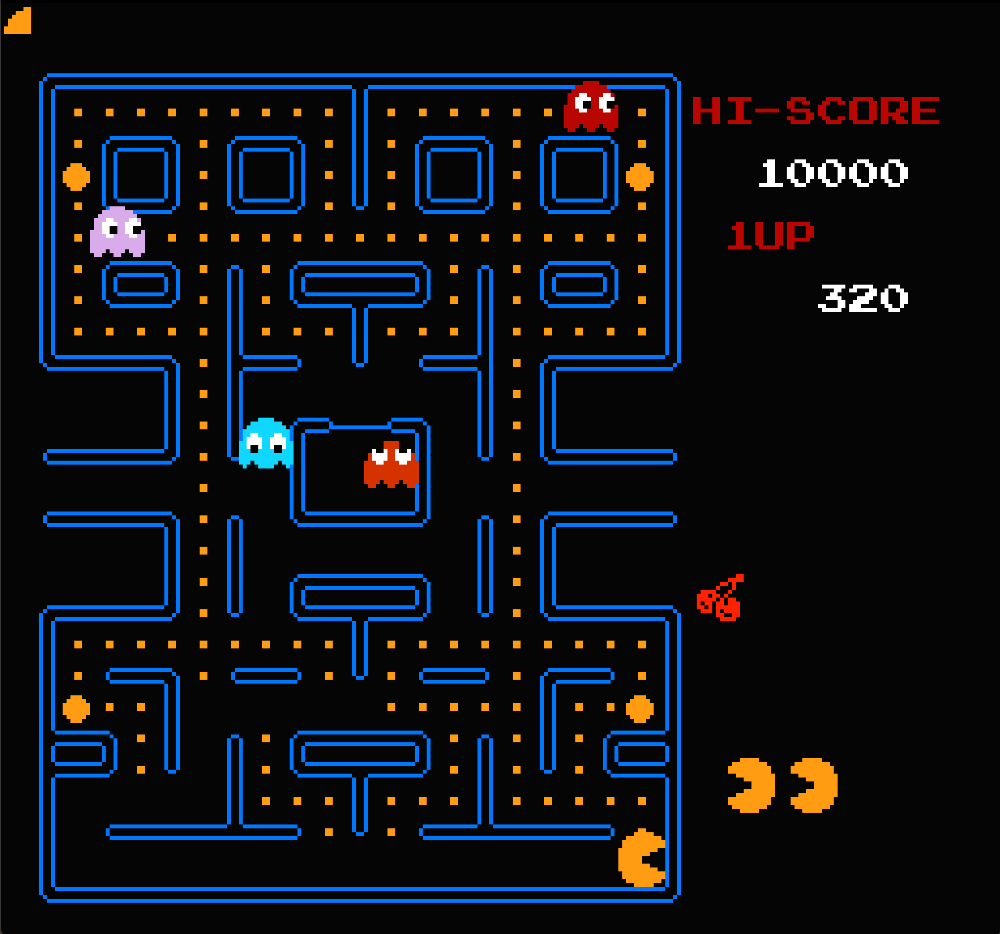
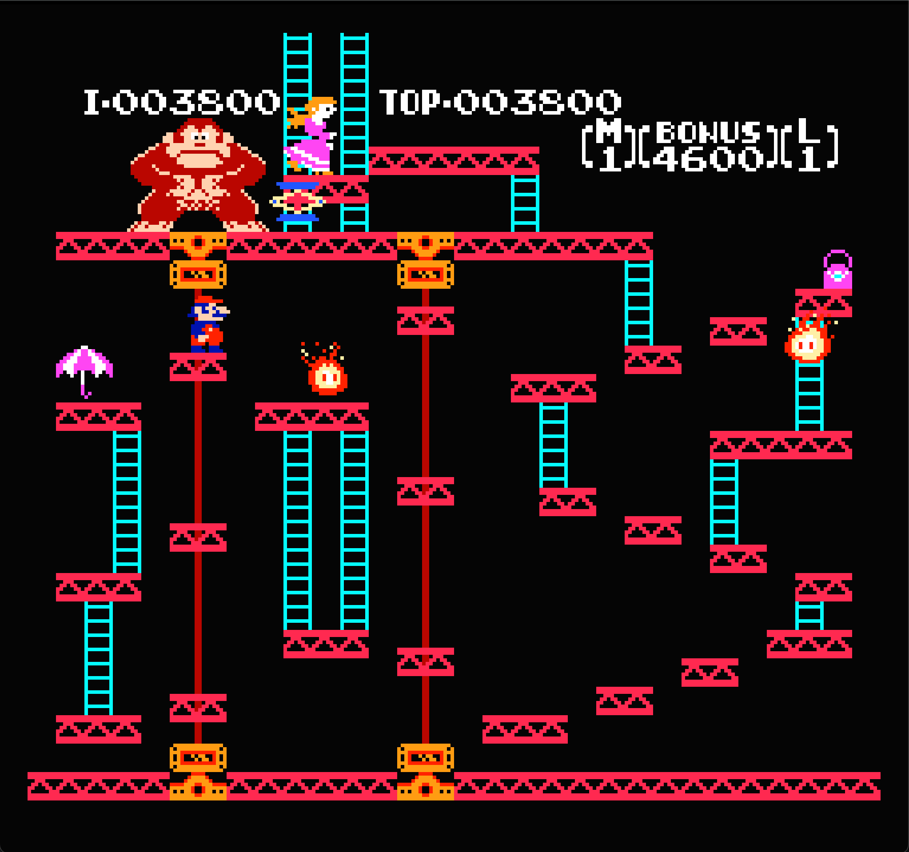

# nestalgia_rs

A (to-be performant) Rust-based emulation of the [Nintendo Entertainment System](https://en.wikipedia.org/wiki/Nintendo_Entertainment_System), rendered with [macroquad](https://github.com/not-fl3/macroquad).

# Features

- [NES 6502](https://www.nesdev.org/wiki/CPU) implementation 
- Basic PPU function

# Runs...

| ROM                 | Status                                                 |
|---------------------|--------------------------------------------------------|
| Pac-man             | :white_check_mark:                                     |
| Balloon Fight       | crashes after 3rd room?                                |
| Donkey Kong         | :white_check_mark:                                     |
| nestest             | :white_check_mark:                                     |
| The Legend of Zelda | :x:                                                    |
| Final Fantasy       | :x:                                                    |

# Building

Copy a ROM into the repo and change the filename in `main.rs`. Then, navigate to `src` and run

- `cargo build --release`
- `cargo run --release`.

I'm planning on implementing nicer UI later.

# Roadmap

- CPU
    - [X] Official instructions
    - [X] BUS
    - [X] Unofficial instructions
    - [X] Cycle accuracy
- Cartridges
    - [X] iNES format
    - [ ] Mapper 1
- PPU
    - [X] PPU registers
    - [X] NMI interrupt
    - [X] Background rendering
    - [X] Foreground rendering
    - [ ] Scrolling
    - [ ] Correct DMA behavior
- UI
    - [X] Controller mappings
    - [ ] FPS
- APU
    - [ ] APU
- Testing/docs
    - [X] 6502 test suite
    - [ ] Blargg CPU/PPU tests
    - [ ] Docs

